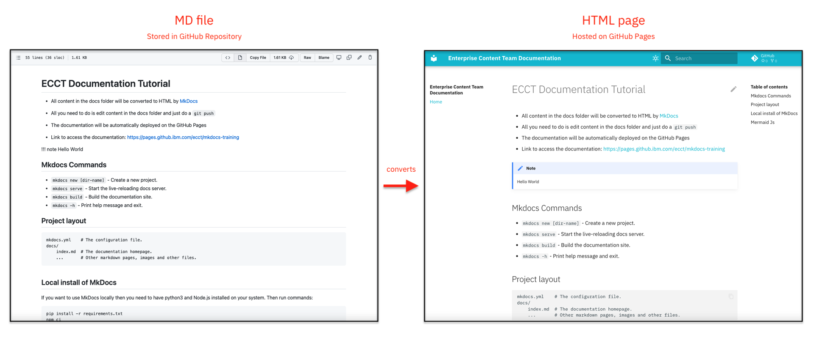

# はじめに

このチュートリアルでは、GitHub から Markdown テキストファイルを静的 HTML サイトに変換し、 GitHub ページにデプロイするプロセスを自動化する方法について学びます。プロジェクトを文書化し、GitHub Pages で文書をホストしたい場合、このチュートリアルは、OpenShift Pipelines を継続的インテグレーション (CI) の仕組みとして使用して、GitHub リポジトリの Markdown ファイルから静的 HTML を自動的に生成するために役立ちます。

このチュートリアルでは、[MkDocs framework](https://www.mkdocs.org)を使用して、Markdown(MD)ファイルから静的HTMLを生成しています。GitHubのリポジトリに存在するMarkdownファイルから以下のようなウェブサイトが生成されていることがわかります。



MkDocsを使うことで、以下のようなアドバンテージを得ることができます。

* ドキュメント内を自由に検索することができます。
* 目次は自動的に生成されます。
* ドキュメントは、セクションごとに整理されています。
* 様々なコードブロックや注釈をサポートしています。

# 事前準備

* このチュートリアルは、[GitHubアカウント](https://github.com/)のみを対象としています。GitLabや他のGitのフレーバーでは動作しません。
* このチュートリアルはシェルスクリプト(.sh)を使用しています。シェルスクリプトは、MacとLinuxで動作します。Windowsでスクリプトを実行したい場合は、[Windows Subsystem for Linux](https://docs.microsoft.com/en-us/windows/wsl/about) をインストールする必要があります。
* [Developer Sandbox for Red Hat OpenShift](https://developers.redhat.com/developer-sandbox/) を利用してOpenShiftクラスタ環境を用意します。
* [OpenShift Command Line Interface tool](https://docs.openshift.com/container-platform/4.6/cli_reference/openshift_cli/getting-started-cli.html)をダウンロードし、インストールします。
* [Tekton CLI](https://tekton.dev/docs/cli/#installation)をダウンロードし、インストールしてください。
* [Python 3.6以上](https://www.python.org/downloads/)をインストールします。
* [Node.js 14.x以上](https://nodejs.org/en/download/)をインストールします。
* [Git CLI](https://git-scm.com/downloads)をダウンロードし、インストールします。

# 所要時間

セルフサービスで実施した場合、30〜40分程度かかります。

# ハンズオン手順

## Step 1: テンプレートリポジトリからドキュメントを作成する

### 1.1. 新しいリポジトリを作成する

<a href="https://github.com/IBM/mkdocs-oc-pipeline" target="_blank" rel="noopener noreferrer nofollow">mkdocs-oc-pipeline テンプレート</a>からリポジトリを作成します。

### 1.2. Git個人用アクセストークンを作成する

<a href="https://github.com/settings/tokens/new" target="_blank" rel="noopener noreferrer nofollow">個人用アクセストークン</a> を作成します。

公開リポジトリの場合は `public_repo` を、非公開リポジトリの場合は `repo` をスコープとします。(アクセストークンが生成されたら、必ずコピーしてください。後で見ることができなくなります)。また、`write:repo_hook`を選択します。

**NOTE**: GitHubの個人アクセストークンは、GitHubリポジトリの詳細を更新したり、GitHubリポジトリのプッシュイベントを検出するTekton Triggerを追加したり、ドキュメントサイト用の新しいブランチを作成するために使用します。テキストエディタにコピーしておいてください。


### 1.3. リポジトリをクローン

リポジトリを作成したら、以下のコマンドでリポジトリをクローンしてください。

```bash
git clone https://github.com/<your-github-username>/<your-repository-name>.git
```

リポジトリは6つのディレクトリと15個のファイルで構成されています。


MkDocsで利用するファイルについては下記を参照ください。

| ファイル名        | 概要  |
|-------------------|-------|
| **mkdocs.yml**    | MkDocs の設定ファイルです。      |
| **docs/index.md** | ドキュメントのホームページです。 |
| **cspell.json**   | スペルチェッカーの設定ファイルです。このファイルで、スペルチェッカーの実行中に無視する単語を追加することができます。 |

### 1.4. 開発環境でドキュメントを実行する

ローカル環境でドキュメントを実行します。以下のコマンドを実行してください。

1. mkdocs ライブラリをpipを使ってインストールします。

   ```bash
   python -m pip install -r requirements.txt
   ```

2. mkdocs サーバを起動します。

   ```bash
   python -m mkdocs serve
   ```

これにより、依存関係がインストールされ、ローカル環境でドキュメントが実行されます。ドキュメントは`http://localhost:8000`からアクセスできます。

ドキュメントを編集して保存します。プレビュー URL リンクで変更点を確認することができます。

### 1.5. ドキュメントを編集する

次にドキュメントに新しい章を追加してみましょう。

1. docs ディレクトリに新しいファイルを作成します。（例：docs/about.md）
1. docs/about.md ファイルに必要な内容を追加し、ファイルを保存します。("Hello World"などでOKです)
1. about.mdファイルをmkdocs.ymlファイルの74行目の**nav**セクションに追加し、変更内容を保存します。

   ```yaml
   nav:
       - Home: index.md
       - About: about.md # この行を追加
   ```

プレビューを確認すると、新しいセクションが追加されたことが確認できます。

ドキュメントを編集する際のヒントについては、以下のサイトを参照してください：

* [Markdown Syntax](https://www.markdownguide.org/basic-syntax/)： Markdownのシンタックスについて
* [Mkdocs](https://www.mkdocs.org/user-guide/configuration)： MkDocsの設定について
* [Mkdocs-material Setup](https://squidfunk.github.io/mkdocs-material/setup/changing-the-colors/)： ドキュメントのテーマを変更する方法について
* [Mkdocs-material Reference](https://squidfunk.github.io/mkdocs-material/reference/)： MkDocsのドキュメントテーマで利用可能なすべてのオプションを確認する方法について

編集が終わったら、ターミナルで**Ctrl+C**を押して、開発サーバーを停止します。

### 1.6. ドキュメントのスペルチェックを行う

スペルミスを避けるために、ドキュメントのスペルチェックを行いましょう。次のコマンドを実行します。

1. npm を使ってスペルチェッカーライプラリをインストールします。

   ```bash
   npm install -g cspell
   ```

1. スペルチェッカーを実行します。

   ```bash
   cspell **/*.md
   ```

さらに、いくつかの単語を無視したい場合は、リポジトリのルートディレクトリの下にあるcspell.jsonファイルの**words**に追加することができます。

マークダウンでスペルチェック対象から特定の用語を無視対象とする方法については、<a href="https://www.npmjs.com/package/cspell" target="_blank" rel="noopener noreferrer nofollow">cspell documentation</a>を参照してください。

### 1.7. ドキュメントをGitHub Pagesにデプロイする

**Note**： このステップでは、Gitの認証情報がローカルに保存されていることを前提としています。

ドキュメントの準備ができ、ローカルでテストしたら、GitHub Pagesにデプロイしましょう。以下のコマンドを実行します。

```bash
python -m mkdocs gh-deploy
```

docsはあなたのリポジトリの`gh-pages`ブランチにデプロイされます。ドキュメントには、`https://<your-github-username>.github.io/<your-repository-name>`でアクセスできます。

## Step 2: OpenShift Pipelinesを使用してGitHub Pagesにドキュメントをデプロイするプロセスを自動化する

ここまでは、ドキュメントの編集、ローカル環境でのドキュメントのプレビュー、スペルチェックのためのlint、そしてGitHub Pagesへのデプロイを学びましたね。さて、OpenShift Pipelinesを使えば、このプロセス全体を自動化することができます。最終的には、ドキュメントを編集し、ローカル環境でプレビューし、変更をGitHubのリポジトリにプッシュすることになります。パイプラインが起動し、スペルのリンティングを行い、ドキュメントを自動的にGitHub Pagesにデプロイします。これにより、手作業でドキュメントのリンティングとデプロイを行うオーバーヘッドを削減することができます。

Red Hat OpenShift Pipelinesは、Tektonを使ってパイプラインを構築するためのクラウドネイティブな継続的インテグレーションとデリバリー（CI/CD）ソリューションです。

<a href="https://tekton.dev" target="_blank" rel="noopener noreferrer nofollow">Tekton</a>は、強力で柔軟なKubernetesネイティブのオープンソースCI/CDフレームワークで、根本的な詳細を抽象化することによって、複数のプラットフォーム（Kubernetes、サーバーレス、VMなど）でのデプロイを自動化するために利用できます。

### 2.1. OpenShift Pipelineをデプロイする

**Note**: Developer Sandbox for Red Hat をご利用の場合は、本節は飛ばしてください。Red Hatがすでに導入しています。

**Note**: OpenShiftにoperatorをデプロイする場合は、管理者権限が必須です。

OpenShift の Webコンソールを開きます。OpenShift Pipeline Operatorをデプロイします。

1. **Operators → OperatorHub** に移動し、**OpenShift Pipeline** を検索します。**Red Hat OpenShift Pipelines** operatorを選択します。
    
1. パネルの **Install** をクリックします。
    
1. 以下のオプションを選択します。
   * **更新チャンネル**：安定型
   * **インストールモード**： クラスタ上のすべてのネームスペース（デフォルト）
   * **インストールされている名前空間**：openshift-operators
   * **更新の承認**： 自動
1. **Install** をクリックします。
1. インストールが完了するのを待ちます。完了すると、以下のメッセージが表示されます。
   

この時点で、OpenShift PipelinesをOpenShiftクラスタに正常にデプロイしています。OpenShiftのWebコンソールの左パネルに、**Administrator**ビューの下に、新しい**Pipelines**タブが表示されます。


### 2.2. プロジェクトのセットアップ

Tektonリソースを作成するためには、OC CLIからOpenShiftクラスタに接続する必要があります。

1. クラスタのOpenShiftウェブコンソールを開きます。
1. OpenShift Webコンソールから、右上のログインしているユーザーIDをクリックし、**Copy Login Command** を選択します。
1. ターミナルで `oc login` コマンドを実行します。
1. 以下のコマンドを実行し、OpenShift にプロジェクトを作成します。

   ```bash
   oc new-project <project-name>
   ```

### 2.3. Tektonリソースの作成

pipelineの設定ファイルは、クローンしたリポジトリ `Openshift Pipeline/` ディレクトリに格納されています。


OpenShift Pipeline設定ファイルについては、以下に説明を記述しています。

| **ファイル**                           | **種別**        | **説明** |
|------------------------------------|-----------------|--------|
| **Pipeline/pipeline.yaml**         | Tekton Pipeline | これがTektonのpipelineの定義です。pipelineには、git-clone、lint、deployという3つのタスクがあります。 |
| **Tasks/mkdocs-setup.yaml**        | Tekton Task     | このタスクはGitHubリポジトリにアクセスできるかチェックします。 |
| **Tasks/mkdocs-lint.yaml**         | Tekton Task     | このタスクはドキュメントのリント(lint)を実行します。 |
| **Tasks/mkdocs-build-deploy.yaml** | Tekton Task     | このタスクはドキュメントのビルドとデプロイを実行します。 |
| **Secrets/github-secrets.yaml**    | Tekton Secret   | これはGitHub認証情報が含まれています。 |
| **Trigger/github-trigger.yaml**    | Tekton Trigger  | このトリガはGitHubリポジトリに新しいcommitがpushされたタイミングで実行されます。 |

Tektonリソースの作成プロセスを簡略化するため、`oc create`コマンドを使用して、これらの設定ファイルをすべてクラスタにデプロイするシェルスクリプトを作成しました。クローンリポジトリのルートディレクトリにある `setup-pipeline.sh` スクリプトは、以下のステップを実行します。

* Tekton Tasksをセットアップします。
* Tekton Pipelineをセットアップします。
* Tekton GitHubの認証情報を設定します。
* Pipeline ServiceAccount に GitHub の認証情報を追加します。
* Tekton TriggerTemplate、EventListener、Routeを設定します。
* GitHub リポジトリの詳細と GitHub Pages のリンクを更新します。
* EventListener を Webhook として GitHub リポジトリに追加します。

ターミナルで `setup-pipeline.sh` スクリプトを実行し、Tektonリソースを作成します。プロンプトが表示されたら、先ほど作成したGitHubのユーザー名と個人用アクセストークンを入力します。

```bash
chmod +x setup-pipeline.sh
./setup-pipeline.sh
```

次のような出力が表示されます。

```bash
-------------Setting up Tekton CI----------------

Using Openshift Project: mymkdocs

Setting up Tekton Tasks...
task.tekton.dev/mkdocs-setup created
task.tekton.dev/mkdocs-lint created
task.tekton.dev/mkdocs-build-deploy created
Tekton Tasks setup complete.

Setting up Tekton Pipeline...
pipeline.tekton.dev/mkdocs-oc-pipeline created
Tekton Pipeline setup complete.

Setting up Tekton Secrets...
Enter your Git username: # Type your GitHub username and press [ENTER]
manojjahgirdar
Enter your Git personal access token: # Type your GitHub personal access token and press [ENTER]
ghp_xxxxxxxxxxxxxxxxxxxxxxxxxxxxx
secret/git-credentials created
secret/git-credentials patched
Git credentials configured. You can view them by running:
oc get secret git-credentials -o yaml

Patching Pipeline ServiceAccount...
serviceaccount/pipeline patched (no change)
Pipeline ServiceAccount setup complete.

Setting up Tekton Trigger...
triggertemplate.triggers.tekton.dev/mkdocs-build-triggertemplate created
eventlistener.triggers.tekton.dev/mkdocs-build-eventlistener created
route.route.openshift.io/mkdocs-build-listener-el created
Tekton Trigger setup complete.

Waiting for the EventListener Route to be Ready...

Updating GitHub Repository Details...
{
  "id": 476268540,
  ...
}
GitHub Repository Details updated successfully.

Adding Webhook to the GitHub Repo...
{
  "type": "Repository",
  "id": 350842818,
  "name": "web",
  "active": true,
  "events": [
    "push"
  ],
  ...
}
Webhook added successfully.

Tekton CI pipeline setup complete.
You can add/update/delete anything in the GitHub Repo:https://github.com/<your-github-username>/<your-repository-name>.git and the Openshift pipeline will run automatically to build the docs and deploy it on 'https://<your-github-username>.github.io/<your-repository-name>'.
Do you want to trigger the pipeline to build mkdocs now? (y/n)
n
You can run the pipeline later with the following command:
tkn pipeline start mkdocs-oc-pipeline -p git-url=https://github.com/<your-github-username>/<your-repository-name>.git -p git-rev=main --use-param-defaults

-----------Tekton CI setup complete-------------
```

**Note**: ターミナルで `delete-pipeline.sh` スクリプトを実行すると、クラスタ内のすべてのTektonリソースをクリーンアップすることができます。

## Step 3: ビルドとデプロイの自動化でドキュメントを見る

ドキュメントを編集し、ローカル環境でプレビューし、変更点をGitHubリポジトリにプッシュします。OpenShift 上で Tekton Pipeline を起動し、GitHub リポジトリのクローン、スペルのリント、GitHub Pages へのドキュメントのデプロイを自動で行います。

## Step 4: (任意) MkDocsのビルドとデプロイ用コンテナイメージのビルド

Tekton Tasksでは、コンテナイメージ<a href="https://hub.docker.com/repository/docker/manojjahgirdar/ubi-mkdocs-builder" target="_blank" rel="noopener noreferrer nofollow">docker.io/manojjahgirdar/ubi-mkdocs-builder:v2.1</a> を使用しています。このコンテナイメージは ubi8-minimal ベースイメージの上に構築されており、`mkdocs` のビルドとデプロイ、`cspell lint` の実行に必要なライブラリがすべて含まれています。

独自のイメージをビルドして `docker.io/manojjahgirdar/ubi-mkdocs-builder:v2.1` イメージを置き換えることができます。ビルドするには、クローンしたレポに含まれるDockerfileを使用します。Dockerfileは以下のような感じです：

```dockerfile
# Using the UBI8/UBI-MINIMAL as the base image
FROM registry.access.redhat.com/ubi8/ubi-minimal@sha256:574f201d7ed185a9932c91cef5d397f5298dff9df08bc2ebb266c6d1e6284cd1

# The container image will have the NodeJS version NODEJS_VERSION
ENV NODEJS_VERSION=14

# All the build will be done in the /build directory
WORKDIR /build
COPY requirements.txt /build/requirements.txt

# Using the microdnf package manager to install git, nodejs and python
RUN microdnf update
RUN microdnf install git -y

RUN echo -e "[nodejs]\nname=nodejs\nstream=${NODEJS_VERSION}\nprofiles=\nstate=enabled\n" > /etc/dnf/modules.d/nodejs.module
RUN microdnf install nodejs && microdnf remove nodejs-full-i18n nodejs-docs

RUN microdnf install python3.9 -y
RUN microdnf clean all

# Using python pip package manager to install the mkdocs libraries
RUN python3 -m pip install --upgrade pip
RUN python3 -m pip install -r requirements.txt

# Using the npm package manager to install the cspell checker
RUN npm install -g cspell

# The mkdocs from a git repository will be cloned into the /docs directory
WORKDIR /docs

CMD ["/bin/bash"]
```

Dockerfileをビルドして、選択したコンテナレジストリにプッシュします。クローンリポジトリのルートディレクトリで、以下を実行します。

```bash
podman build -t imagename:imagetag .
podman push imagename:imagetag
```

コンテナイメージが用意できたら、Tekton Tasksでコンテナイメージ名を置き換えることができます。

## サマリー

このチュートリアルでは、OpenShift Pipelinesを使って、GitHubのMarkdownテキストファイルを静的HTMLサイトに変換し、GitHub Pagesにデプロイする処理を自動化する方法を学びました。

## 著作者 / Author

このコンテンツは以下2名がオリジナルを作成し、それを日本語化したものとなります。

They are the author of the original english content.
* Manoj Jahgirdar
* Brian Innes
